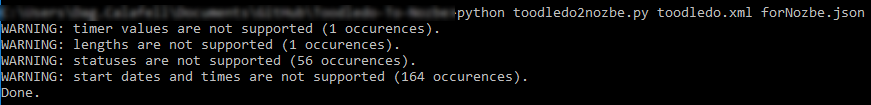

# Toodledo-To-Nozbe
> Dag Calafell, III

A converter of data from toodledo XML format to Nozbe import format.

## Requirements
Python and BeautifulSoup4
After installing Python install BeautifulSoup4 using command:
```
pip install BeautifulSoup4 
```

## Examples
```
python toodledo2nozbe.py toodledo.xml forNozbe.json
```



## Contribute

Contributions are always welcome!

## License

[](https://creativecommons.org/publicdomain/zero/1.0/)

To the extent possible under law, [Dag Calafell](http://calafell.me/) has waived all copyright and related or neighboring rights to this work.